# 심화된 자료구조

### 연결리스트(Linked List)

**연결 리스트란?**

-   여러개의 **노드**들이 한 줄로 연결

-   노드 = **저장할 데이터** + 다음 노드로의 연결

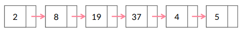  

<br>

**단순 연결 리스트**

-   **한 방향**으로만 이어진 연결 리스트

  

<br>

**이중 연결 리스트**

-   **양쪽 방향**으로 이어진 연결 리스트

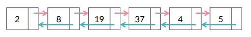  

<br>

**원형 연결 리스트**

-   **가장 뒤의 노드**가 **맨 앞의 노드**에 연결된 연결 리스트

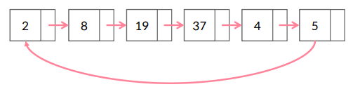  

<br>

**기타 연결 리스트**

-   **아무 형태**의 연결 리스트 모두 가능!

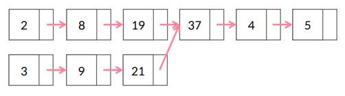  

<br>

**배열 VS 연결 리스트**

-   **배열**: 인덱스 이용해서 데이터 접근
    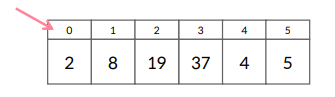  

-   **연결 리스트**: 현재 노드에서 연결된 노드로만

    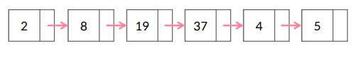  

<br>

**헤드 Head**

-   어딘가에서는 시작을 해야하므로!

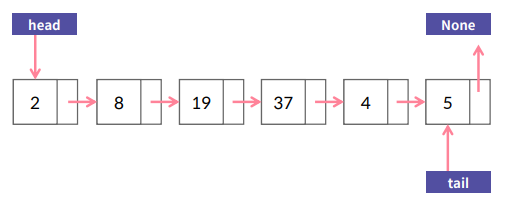  

<br>

**연결 리스트 시간 복잡도**

-   자료 중간에 추가/삭제 : `O(1)`

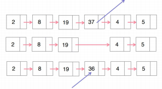  

<br>

>   배열 시간 복잡도와 비교해보면?
>
>   nums.insert(3, 9) : `O(N)`

<br>

<br>

[실습 1]

## 연결 리스트 <–> 배열 변환하기

연결 리스트 클래스 LinkedList와, 그 노드 클래스 Node가 주어졌습니다.

연결 리스트 객체가 주어졌을때 이를 배열로 변환해서 반환하는 함수 toArray와, 배열이 주어졌을때 이를 연결 리스트로 변환해서 반환하는 함수 toLinkedList를 구현 해 봅시다.

```python
# 연결 리스트의 노드. 단일 연결 리스트의 경우입니다.
class Node:
    def __init__(self, val):
        self.val = val
        self.next = None
        
    def __str__(self):
        return str(self.val)

# 연결 리스트 클래스. head 와 tail을 가지고 있으며, 가장 뒤에 새로운 노드를 추가하는 addToEnd 함수가 있습니다.
class LinkedList:
    def __init__(self, head):
        self.head = head
        self.tail = head
    
    def addToEnd(self, node):
        self.tail.next = node
        self.tail = node
        
    def __str__(self):
        node = self.head
        toPrint = []
        while node:
            toPrint.append(str(node.val))
            node = node.next
        return "->".join(toPrint)

####################################################################################################################################

# 주어진 연결 리스트 ll을 배열로 변환해 봅시다.
# 이때 연결 리스트 LinkedList의 객체가 입력으로 주어진다고 가정합니다.
def toArray(llNode):
    arr = []
    it = llNode.head
    
    while it != llNode.tail: # 마지막에서 두번째 원소까지 순회
        arr.append(it.val)
        it = it.next
        
    arr.append(it.val) # 마지막 원소
    return arr


# 주어진 배열을 연결 리스트로 변환 해 봅시다.
def toLinkedList(lst):
    
    llNode = LinkedList(Node(lst[0]))
    
    for i in lst[1:]:
        llNode.addToEnd(Node(i))
        
    return llNode

def example():
    ## Linkedlist 클래스와 Node 클래스를 사용하는 예시입니다.
    ll = LinkedList(Node(3))
    ll.addToEnd(Node(4))
    ll.addToEnd(Node(8))
    print(ll)
    print(ll.head)
    print(ll.tail)

def main():
    example()
    nums = [2,8,19,37,4,5]
    ll = toLinkedList(nums)
    print(ll)
    lst = toArray(ll)
    print(lst)

if __name__ == "__main__":
    main()
```

<br>

<br>

[실습 2]

## 연결 리스트에서 노드 삭제하기

연결 리스트가 주어지고, 이 연결리스트에서 삭제하고 싶은 노드의 값이 주어졌다고 해 봅시다.

연결 리스트를 순회하면서 해당 노드를 찾아서, 삭제하는 함수를 만들어 봅시다.

주어진 연결 리스트에서 직접 삭제를 시행하면 되기 때문에, 해당 연결 리스트를 반환 할 필요는 없습니다.

<br>

#### 문제 조건

-   연결리스트에는 중복된 수가 없습니다.

<br>

```python
# 연결 리스트의 노드. 단일 연결 리스트의 경우입니다.
class Node:
    def __init__(self, val):
        self.val = val
        self.next = None
        
    def __str__(self):
        return str(self.val)

# 연결 리스트 클래스. head 와 tail을 가지고 있으며, 가장 뒤에 새로운 노드를 추가하는 addToEnd 함수가 있습니다.
class LinkedList:
    def __init__(self, head):
        self.head = head
        self.tail = head
    
    def addToEnd(self, node):
        self.tail.next = node
        self.tail = node
        
    def __str__(self):
        node = self.head
        toPrint = []
        while node:
            toPrint.append(str(node.val))
            node = node.next
        return "->".join(toPrint)

# 주어진 배열을 linkedlist로 변환해서 돌려줍니다. 실습 3-1을 참조하세요
def toLinkedList(lst):
    ll = LinkedList(Node(lst[0]))
    for i in range(1, len(lst)):
        ll.addToEnd(Node(lst[i]))
    
    return ll
    
####################################################################################################################################

def deleteNode(ll, valToDelete):
    if ll.head.val == valToDelete:
        ll.head = ll.head.next
    
    curNode = ll.head
    nextNode = curNode.next
    
    while nextNode:
        if nextNode.val == valToDelete:
            curNode.next = nextNode.next # 삭제
            
            if nextNode == ll.tail:
                ll.tail = curNode
            break
            
        curNode = curNode.next
        nextNode = curNode.next
    return None

def main():
    nums = [2,8,19,37,4,5]
    ll = toLinkedList(nums)
    print(ll)
    deleteNode(ll, 19)
    print(ll) # 19를 삭제하였으므로, 2->8->37->4->5
    deleteNode(ll, 3)
    print(ll) # 3이 없으므로, 2->8->37->4->5

if __name__ == "__main__":
    main()
```

<br>

<br>

### 큐(Queue)

**큐**

-   먼저 줄 선 사람이 먼저 나간다
    = FIRST IN FIRST OUT (FIFO)

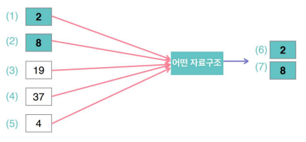  

<br>

**큐 시간 복잡도**

-   입력하기 : `O(1)`
-   출력하기 : `O(1)`

<br>

**큐 작동 방식**

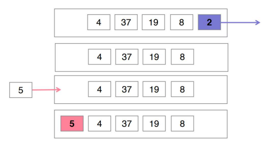  

<br>

**큐 in Python**

-   queue library 활용

```python
import queue
q = queue.Queue()
q.put(2)
q.put(8)
q.get()
```

<br>

-   배열을 큐(Queue)로 활용

```python
q = [8, 19, 37, 4, 5]

q.insert(0, 2) # 맨 앞에 입력한다
q.pop() # 맨 뒤에서 가져온다
```

>   배열을 활용했을 때 문제점은? 시간 복잡도!

<br>

<br>

[실습 3]

스트리밍 데이터의 이동 평균

<br>

<br>

### 스택(Stack)

**스택**

-   나중에 줄 선 사람이 먼저 나간다

    = LAST IN FIRST OUT (LIFO)

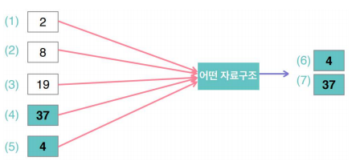  

<br>

**스택 시간 복잡도**

-   입력하기 : `O(1)`
-   출력하기 : `O(1)`

<br>

**스택 작동 방식**

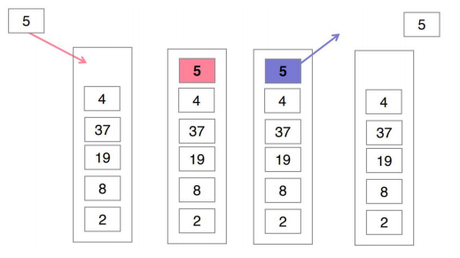  

<br>

**스택 in Python**

-   배열을 스택(Stack)으로 활용

```python
Stack = []
Stack.append(2)
Stack.append(5)
Stack.pop() #5를 반환
```

<br>

<br>

[실습 4]

괄호 매칭

