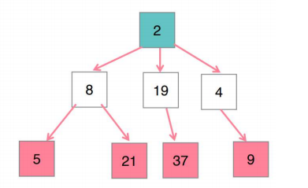

# 자료구조의 끝판왕

### 재귀 함수

**프로그램의 핵심 : 되풀이**

-   비슷한 일을 여러번 **되풀이**해서 풀어내기

```python
def doSomething(nums):
    sum = 0
    for num in nums:
    	sum = sum + num
    return sum
```

sum = sum + num의 반복!

<br>

**반복 VS 재귀**

-   `반복 (Iteration)`

    우리가 지금까지 익히 썼던 개념  
    for, while 등을 사용한 되풀이법  

-   `재귀 (Recursion)`

    스스로를 호출하는 방식의 반복법

<br>

**재귀 (Recursion)**

-   스스로를 호출하는 방식의 반복법

어떤 주어진 **일(Task)**이 같은 과정을 필요로 하지만 더 범위가 **작은 일(Sub Task)**들로 나눠질 수 있다면, 재귀를 적용할 수 있다. 

<br>

-   언젠가는 끝이 나야하므로 식의 종료 조건이 필요

    = **Base** 조건 ( ex. f(0) = 1, f(1) = 2 … )

<br>

-   예) 1을 n번 더하기 

    Task(n) = 1 + Task(n-1) 

    = 2 + Task(n-2) … 

    = n + Task(0) = n + 0 = n

<br>

**예) 팩토리얼 계산**

-   factorial(n) = n! = n * n-1 * n-2 * … * 1
-   factorial(n-1) = (n-1)! = n-1 * n-2 * … * 1

→ 이 경우, factorial(n) = n * factorial(n-1)

즉, factorial 구현 안에서 factorial 사용 가능 = **재귀**

<br>

<br>

[실습 1]

## 팩토리얼 계산하기

팩토리얼(!) 은 하나의 정수를 n을 입력받고 n X n-1 X n-2 X …. X 1 을 반환하는 연산자입니다.

예를 들어서, 5! = 5 X 4 X 3 X 2 X 1 = 120 입니다.

팩토리얼 연산자를 파이선 함수로 구현 해 봅시다. 재귀(recursion)방법과 반복(iteration)방법의 두 가지 다른 방법으로 구현 해 보도록 합시다.

-   1! = 1, 0! = 1 입니다.
-   입력값은 0보다 크거나 같은 정수라고 가정합시다.

<br>

recursion

```python
def factorial(num):
    # recursion
    # factorial(n) = n * factoyial(n-1)
    if num == 0: # 종료 조건
        return 1
    return num * factorial(num-1)

def main():
    print(factorial(5)) # should return 120

if __name__ == "__main__":
    main()
```

<br>

iteration

```python
def factorial(num):
    # iteration
    x = 1
    for each in range(1, num+1):
        x = x * each
    return x
```

<br>

<br>

**심화 : 동적 프로그래밍**

-   Dynamic Programming

`재귀` + `정보 저장 (메모이제이션)`

한 부분 문제를 한 번 계산했다면 다시 계산 할 필요가 없도록!

→ 저장 값을 다른 자료 구조에 저장

<br>

<br>

[실습 2]

## 피보나치 수

피보나치 수열은 `N 번째 수가 N-1번째 수와 N-2번째 수의 합`인 수열입니다.
즉, F(0) = 0, F(1) = 1이며 그 이외의 모든 F(n) = F(n-1) + F(n-2) 입니다.

예를 들어서 피보나치 수열을 0~ 10번째까지 적어보면

0, 1, 1, 2, 3, 5, 8, 13, 21, 34, 55

와 같습니다.

F(10) = F(9) + F(8) = 21 + 34 = 55 임을 확인 할 수 잇습니다.

0보다 크거나 같은 입력 정수 n이 주어졌을때 n번째 피보나치 수를 반환하는 함수를 구현 해 봅시다.

예를 들어서, 10이 입력으로 주어지면 55를 반환해야 합니다.

재귀 방법으로 구현 해 보도록 합시다. 메모이제이션도 활용 해 보도록 합시다.

<br>

```python
class Fib():
    def __init__(self):
        self.memo = {}

    def fibonacci(self, num):
        if num == 0:
            return 0
        if num == 1:
            return 1
            
        if num in self.memo:
            return self.memo[num]
            
        self.memo[num] = self.fibonacci(num-1) + self.fibonacci(num-2)
        
        return self.memo[num]
        
        
def main():
    f = Fib()
    print(f.fibonacci(10)) # should return 55

if __name__ == "__main__":
    main()
```

<br>

<br>

### 트리

**트리**

-   나무 형태의 자료구조

  

<br>

**부모와 자식**

-   부모 노드 → 자식 노드 방향으로 연결이 존재

  

<br>

**루트와 리프**

-   `루트(root)` : 부모가 없는 노드
-   `리프(leaf)` : 자식이 없는 노드

  

<br>

**트리의 깊이**

-   루트에서 리프까지의 경로의 길이, `Depth`

-   트리의 깊이 = 2 **leaf까지의 경로의 길이**

  

<br>

**트리의 특성**

1.  `루트는 하나`
2.  `방향성 존재`
3.  `순환 구조가 없음`

  

<br>

**이진 트리**

-   모든 노드가 최대 2개의 자식 노드를 가지는 트리  
    2개 이하 (0개 가능)

  

<br>

**완전/포화 이진 트리**

  

완전 이진 트리 (Complet Binany Tree)

1.  마지막 레벨 제외 모든 노드가 채워져있는가
2.  마지막 레벨 노드가 왼쪽부터 채워져있는가

포화 이진 트리 (Full Bibany Tree)

1.  마지막 레벨 제외 모든 노드의 자식 2개

<br>

**이진 탐색 트리**

-   Binary Search Tree : `BST`

  

모든 부모 노드의 값이 **왼쪽 자식 트리**에 있는 값보다는 **크고** 오른쪽 자식 트리에 있는 값보다는 **작은** 형태의 트리

<br>

**트리 관련 문제의 핵심 = 탐색**

-   루트 노드가 주어졌을 때 트리를 구석구석 훑어가며 원하는 목적을 달성하는 것!

  

<br>

<br>

### 너비 우선 탐색 (BFS)

-   Breadth First Search : **반복 기반**의 탐색

  

```python
def BFS(root):
    q = queue.Queue()
    q = put(root)
    while q.qsize() > 0:
        node = q.get()
        if node:
            //doSomething
        q.put(node.left)
        q.put(node.right)
```

<br>

**큐에 노드를 순서대로 넣고 빼는 방식으로 탐색**

  

<br>

**횡적으로 한 층씩 탐색하는 방식**

  

<br>

<br>

[실습 3]

## 이진 트리 출력하기

완벽한 이진 트리가 주어졌다고 합시다. 이때, 이 트리를 출력하기 좋은 형태로 반환하는 함수를 구현 해 봅시다.
위에서부터 순서대로, 트리의 각 층별로 하나의 배열을 만들고, 이 배열들의 배열을 반환하는 형태면 됩니다.

예를 들어서

```
 1
2 3
```

와 같은 트리가 주어졌을 경우 `[[1],[2,3]]` 을,

```
   1
 2   3
4 5 6  7
```

과 같은 트리가 주어졌을 경우에는 `[[1],[2,3],[4,5,6,7]]`을 반환하면 됩니다.

<br>

```python
import queue

#====이 문제를 풀기 위해 필요한 클래스와 함수들입니다. 따로 수정 할 필요는 없습니다.
class Node():
    def __init__(self, val):
        self.val = val
        self.left = None
        self.right = None

def listToCompleteBinaryTree(lst):
    def helper(index):
        if index >= len(lst):
            return None
        node = Node(lst[index])
        node.left = helper(index * 2 + 1)
        node.right = helper(index * 2 + 2)
        return node
    return helper(0)
#=================================================================================
def printTree(node):
    all_lines = []
    line = []
    
    q = queue.Queue()
    q.put(node)
    q.put(Node(-1)) # -1을 통해서 각 깊이를 구별하기 위해서
    
    while q.qsize() > 0:
        node = q.get()
        
        if not node:
            continue
        
        else:
            if node.val == -1: # -1을 만나면 새 리스트
                if q.qsize() > 0:
                    all_lines.append(line)
                    line = []
                    q.put(Node(-1))
                    
            else:
                line.append(node.val)
                q.put(node.left)
                q.put(node.right)
                
    return all_lines

def main():
    node = listToCompleteBinaryTree([1,2,3,4,5,6,7])
    print(printTree(node)) # [[1], [2, 3], [4, 5, 6, 7]]

if __name__ == "__main__":
    main()
    
```

<br>

<br>

### 깊이 우선 탐색 (DFS)

-   Depth First Search : **재귀 기반**의 탐색

  

```python
def DFS(node):
    //doSomething
    if node == 리프노드:
        doSomething
        return
    DFS(node.left)
    DFS(node.right)
```

<br>

**가장 깊은 곳까지 내려갔다가 오는 방식의 탐색**

  

<br>

<br>

[실습 4]

## 트리의 경로의 합

완벽한 이진 트리가 주어졌다고 합시다. 그리고 어떤 합 숫자가 주어졌다고 합시다. 이때, 이 트리의 루트(root)에서부터 잎(leaf)까지의 가능한 경로들을 고려해서, 이 경로들 중 최소 하나 이상의 해당 경로상의 value들의 합산과 주어진 합 숫자가 일치하면 True를, 아니면 Fals를 반환하는 함수를 구현 해 봅시다.

예를 들어서,

```
 1
2 3
```

와 같은 트리가 주어지고 3 값이 주어진다면 1->2 경로의 합이 3이기 때문에 True를 반환하면 됩니다.

```
   1
 2   3
4 5 6  7
```

과 같은 트리가 주어지고 8이 주어진다면 1->2->5 경로의 합이 8이기 때문에 True를 반환하면 됩니다. 하지만 만약 15가 주어진다면 해당 트리의 어떤 경로도 합산이 15가 되지 않기 때문에 False를 반환하면 됩니다.

-   깊이 우선 탐색을 활용 해 봅시다.

<br>

```python

#====이 문제를 풀기 위해 필요한 클래스와 함수들입니다. 따로 수정 할 필요는 없습니다.
class Node():
    def __init__(self, val):
        self.val = val
        self.left = None
        self.right = None

def listToCompleteBinaryTree(lst):
    def helper(index):
        if index >= len(lst):
            return None
        node = Node(lst[index])
        node.left = helper(index * 2 + 1)
        node.right = helper(index * 2 + 2)
        return node
    return helper(0)

def printTree(node):
    q = [Node(-1), node]

    line = []
    while q:
        node = q.pop()
        if not node:
            continue
        elif node.val == -1:
            if len(line) > 0:
                print(" ".join(line))
                line = []
                q.insert(0,Node(-1))
        else:
            q.insert(0,node.left)
            q.insert(0,node.right)
            line.append(str(node.val))
#=================================================================================
def path_sum(node, targetSum):
    def dfsHelper(node, curSum):
        # 여기에 깊이 우선 탐색을 구현 해 봅시다.
        if node is None: # 리프노드일 때 합계가 목표와 같은지 체크
            if curSum == targetSum:
                return True
            else:
                return False
        
        else:
            curSum += node.val
            is_left = dfsHelper(node.left, curSum)
            is_right = dfsHelper(node.right, curSum)
        return is_left or is_right
    dfsHelper(node, 0)
    
    return dfsHelper(node, 0)
    
def main():
    node = listToCompleteBinaryTree([1,2,3,4,5,6,7])
    printTree(node)
    print(path_sum(node, 8)) # return True
    print(path_sum(node, 15)) # return False

if __name__ == "__main__":
    main()
```

<br>