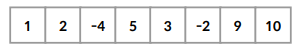
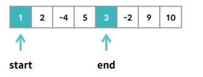

# 문제 해결 절차, 완전 탐색, 시간복잡도

### 문제 해결 절차

1.  문제를 정확히 이해한다 
2.  문제를 해결하는 알고리즘을 개발한다 
3.  알고리즘이 **문제를 해결한다는 것을 증명한다** 
4.  알고리즘이 **제한시간내에 동작한다는 것을 보인다** 
5.  알고리즘을 코드로 작성한다
6.  제출 후 만점을 받고 매우 기뻐한다

<br>

<br>

### 완전탐색

**완전탐색(Brute-Force)**

가능한 모든 경우를 시도해 보는 것

가능한 모든 경우가 무엇인가?

-   **가능한 모든 경우**를 전부 고려해도 괜찮을 경우에는 **단순히 모든 경우**를 고려함으로써 문제를 해결한다

<br>

**완전탐색의중요성**

문제가 주어지면 **무.조.건** **완전탐색법**으로 먼저 시도해야 한다.

<br>

상식적인문제해결의흐름

<br>

[실습 1]

## 연속 부분 최대합

n개의 숫자가 주어질 때, 연속 부분을 선택하여 그 합을 최대화 하는 프로그램을 작성하시오. 예를 들어, 다음과 같이 8개의 숫자가 있다고 하자.

```
1 2 -4 5 3 -2 9 -10
```

이 때, 연속 부분이란 연속하여 숫자를 선택하는 것을 말한다. 가능한 연속 부분으로써 [1, 2, -4], [5, 3, -2, 9], [9, -10] 등이 있을 수 있다. 이 연속 부분들 중에서 가장 합이 큰 연속 부분은 [5, 3, -2, 9] 이며, 이보다 더 합을 크게 할 수는 없다. 따라서 연속 부분 최대합은 5+3+(-2)+9 = 15 이다.

#### 입력 예시

```
1 2 -4 5 3 -2 9 -10
```

#### 출력 예시

```
15
```

<br>

#### 문제 조건

-   입력되는 수의 개수는 최대 100개입니다.

<br>

### 풀이

연속된 부분을 선택하였을 때, 그 최대합을 출력

  

완전 탐색

  

`len(list) = n`

정의되는 값 : `p` n개 (0~n-1), `q` n-p개 (p~n-1)

모든 연속부분을 구하는 시간 복잡도: `O(n²)` 1~n 합

연속부분의 합을 구하는 시간 복잡도 : `O(n)`

전체 시간 복잡도 : `O(n³)`

<br>

입력되는 수 최대 100개 = 최대 1,000,000번

엘리스 플랫폼 25,000,000번 = 1초

<br>

```python
import sys
import math

def getSubsum(data) :
    '''
    n개의 숫자가 list로 주어질 때, 그 연속 부분 최대합을 반환하는 함수를 작성하세요.
    '''
    
    # 모든 경우를 구하고, 가장 큰 것 출력
    
    result = -math.inf
    temp = 0
    
    for start in range(0, len(data)):
        for end in range(start, len(data)):
            temp = 0
            for i in range(start, end+1):
                temp += data[i]
            result = max(result, temp)

    return result

def main():

    data = [int(x) for x in input().split()]

    print(getSubsum(data))

if __name__ == "__main__":
    main()
```

<br>

<br>

[실습 2]

## 멱집합 구하기

집합 A에 다하여, A의 모든 부분집합을 원소로 가지는 집합을 A의 멱집합이라고 한다. 예를 들어, 집합 A의 원소가 {1, 2, 3} 일 경우, A의 멱집합은 다음과 같이 8개의 원소를 갖는 집합이다.

{}, {1}, {2}, {3}, {1, 2}, {1, 3}, {2, 3}, {1, 2, 3}

집합 A의 원소는 1부터 n*n*까지의 자연수로 구성된다. n*n*이 주어질 때, A의 멱집합의 원소를 사전 순서대로 모두 출력하는 프로그램을 작성하시오. 단, 공집합은 제외하고 출력한다.

#### 입력 예시

```
3
```

#### 출력 예시

```
1
1 2
1 2 3
1 3
2
2 3
3
```

<br>

#### 문제 조건

-   원소의 개수는 10개를 넘지 않습니다.
-   공집합은 출력하지 않습니다.

<br>

### 풀이

**전체경우: 1을 선택하는 경우와 그렇지 않은 경우**

`getPowerSet(n, k)` :  k를 첫 원소로 갖는 집합을 반환

`getPowerSet(3, 1)` : [[1], [1,2], [1,2,3], [1,3]]

`getPowerSet(3, 2)` : [[2], [2,3]]

`getPowerSet(3, 3)` : [[3]]

`getPowerSet(3, 1)` 은 `getPowerSet(3, 2)`, `getPowerSet(3, 3)`에 1을 붙이면 된다.

<br>

결과적으로 `getPowerSet(3, 1)` + `getPowerSet(3, 2)` + `getPowerSet(3, 3)` 를 구하자.

<br>

```python
import sys

def getPowerSet(n, k):
    '''
    1부터 n까지의 자연수의 원소가 있을 때 k를 가장 처음으로 선택하는 경우 반환
    3,2
    [[2], [2,3]]
    
    3,3
    [[3]]
    '''
    
    if n == k:  # 기저조건
        return [[k]]
        
    '''
    getPowerSet(3, 1)
    [[1], [1,2], [1,2,3], [1,3]]
    
    temp : [[2], [2,3]]
    
    getPowerSet(3, 2)
    [[2], [2,3]]
    
    temp : [[3]]
    
    '''
    
    result =[[k]]
    
    temp = []
    
    for i in range(k+1, n+1):
        temp = temp + getPowerSet(n, i)
        # if k == 1
        # temp = [[2], [2,3], [3]]
        
    for i in range(len(temp)):
        temp[i] = [k] + temp[i]
        
    return result + temp

def powerSet(n) :
    '''
    n개의 원소를 가지는 집합 A의 멱집합의 원소를 사전 순서대로 list로 반환하는 함수를 작성하시오.

    예를 들어, n = 3 일 경우 다음의 list를 반환한다.

    [ [1], [1, 2], [1, 3], [1, 2, 3], [2], [2, 3], [3] ]
    
    
    (3,1) + (3,2) + (3,1)
    '''
    
    result = []
    
    for i in range(1, n+1):
        result += getPowerSet(n,i)

    return result

def main():
    n = int(input())

    result = powerSet(n)
    
    for line in result :
        print(*line)

if __name__ == "__main__":
    main()
```

<br>

<br>

[실습 3]

## 균형 맞추기

n개의 숫자가 주어진다. 이제 이 숫자를 두 개의 그룹으로 나눌 것이다. 예를 들어 5개의 숫자 [1, -3, 4, 5, -2] 가 주어진다면, 이를 두 개의 그룹으로 나누는 경우는 여러가지가 있을 수 있다. 가능한 경우로써 [1, -3], [4, 5, -2] 가 있을 수 있고, 또 다른 경우로는 [1, 4, -2], [-3, 5] 가 있을 수 있다.

나눈 두 그룹을 A, B라고 할 때, (A의 원소의 합) - (B의 원소의 합) 의 절댓값을 최소화 하는 프로그램을 작성하시오. 위의 예제에서는 A = [1, 4, -2], B = [-3, 5] 라고 하였을 때 (A의 원소의 합) - (B의 원소의 합) 의 절댓값 = |3 - 2| = 1 이며, 이보다 더 작은 값을 만드는 A, B는 존재하지 않는다.

이 경우 절댓값의 최솟값인 1을 출력하면 된다.

#### 입력 예시

```
1 -3 4 5 -2
```

#### 출력 예시

```
1
```

<br>

#### 문제 조건

-   입력되는 수는 최대 20개를 넘지 않는다.

<br>

### 풀이

모든 부분 집합과 각각의 여집합의 합을 구하자.

완전 탐색

<br>

```python
import sys
import math

# 기존 getPowerSet, PowerSet 함수 가져옴
def getPowerSet(n, k):
    if n == k:
        return [[k]]
    
    result =[[k]]
    temp = []
    
    for i in range(k+1, n+1):
        temp = temp + getPowerSet(n, i)
        
    for i in range(len(temp)):
        temp[i] = [k] + temp[i]
        
    return result + temp

def powerSet(n) :
    result = []
    
    for i in range(1, n+1):
        result += getPowerSet(n,i)

    return result

def makeEqual(data) :
    '''
    n개의 숫자를 두 그룹 A, B로 나눈다고 할 때,

    | (A의 원소의 합) - (B의 원소의 합) | 의 최솟값을 반환하는 함수를 작성하시오.
    '''
    
    # data = [1 -3 4 5 -2]
    combinations = powerSet(len(data)) # 모든 경우의 수가 저장
    
    total = sum(data) # 전체 부분 집합의 합
    result = math.inf # 매 순간 최솟값 저장
    
    for c in combinations:
        # c = [1] [1,2] [1,2,3] ... [4, 5] [5]
        mySumA = 0
        mySumB = 0
        
        for i in c:
            mySumA += data[i-1]
            mySumB = total - mySumA
            
        result = min(result, abs(mySumA-mySumB))

    return result

def main():
    data = [int(x) for x in input().split()]

    print(makeEqual(data))

if __name__ == "__main__":
    main()
```

<br>

<br>

### Complexity

**ComplexityTheory**

크기에 따른 정렬은 `O(NlogN)`

각 문제마다 풀이의 **시간복잡도**가 다르다

내 풀이가 **얼마나 좋은 풀이**인가?

<br>

문제자체에도 복잡도가 존재한다

`P class` : 다항시간

`NP-Completeclass` : 답을 검증하는데 다항시간

<br>

**알고리즘과정에서다루는문제들**

(거의 대부분) **P 문제**들만을 다룬다

알고리즘에서는 **고려해야 하는 경우**를 줄이는 방법을 배운다

하지만 대표적인 **NP-Complete **문제는 알면 좋다

<br>