# 분할정복법

### 재귀호출을 이용한 문제 해결

**재귀함수의 올바른 디자인 및 해석**

재귀함수를 디자인 하기 위한 세 가지 단계

1.  함수의 **정의**를 명확히 한다
2.  기저 조건에서 함수가 제대로 동작하게 작성한다
3.  함수가 제대로 동작한다고 가정하고 **함수를 완성**한다

<br>

[실습 1]

## 가장 가까운 값 찾기

오름차순으로 정렬된 n개의 숫자가 주어지고, 정수 m이 주어질 때, n개의 숫자 중에서 m과 가장 가까운 숫자를 출력하는 프로그램을 작성하시오. 만약 가장 가까운 숫자가 2개 이상이라면, 그 중 가장 작은 숫자를 출력한다.

### 입력 예시 1

```
1 4 6 7 10 14 16
8
```

### 출력 예시 1

```
7
```

### 입력 예시 2

```
1 4 6 7 10 14 16
12
```

### 출력 예시 2

```
10
```

<br>

### 문제 조건

-   입력되는 수의 개수는 최대 100,000개입니다.
-   만약 가장 가까운 숫자가 2개 이상일 경우, 그 중 가장 작은 값을 출력합니다.

<br>

### 풀이

cf) **이진탐색** = `O(NlogN)`

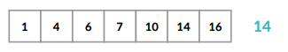  

중간값부터 시작 하여 2번만에 14를 찾을 수 있다.

<br>

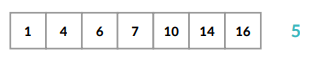  

중간값부터 시작하여 5가 없다는 것을 3번만에 알 수 있다.

<br>

실전) **가장 가까운 값 찾기**

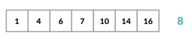  

중간값을 버릴 수 없다! 더 가까울 수 있으므로

<br>

```python
import sys

def getNearsestInternal(data,m):
    # m과 가장 가까운 후보인 두 값을 리턴하는 함수
    
    if len(data) == 1:
        return (data[0], data[0])
    elif len(data) == 2:
        return (data[0], data[1])
        
    mid = len(data) // 2
    
    if data[mid] <= m:
        return getNearsestInternal(data[mid:], m)
    else:
        return getNearsestInternal(data[:mid+1], m)

def getNearest(data, m) :
    '''
    n개의 숫자가 list로 주어지고, 숫자 m이 주어질 때, n개의 숫자 중에서 m과 가장 가까운 숫자를 반환하는 함수를 작성하세요.
    
    가장 가까운 값 후보인 두 값을 찾고, 더 가까운 것 반환
    '''
    
    value = getNearsestInternal(data, m)
    
    # value[0] : m 이하이면서 가장 가까운 값
    # value[1] : m 이상이면서 가장 가까운 값
    
    if m - value[0] <= value[1] - m:
        return value[0]
    else:
        return value[1]

    return 0

def main():
    data = [int(x) for x in input().split()]
    m = int(input())

    print(getNearest(data, m))

if __name__ == "__main__":
    main()
```

<br>

<br>

[실습 2]

## 거듭제곱 구하기

본 연습문제에서는 mⁿ을 구하는 프로그램을 작성합니다.

입력으로는 m, n이 차례대로 입력됩니다.

**만약 getPower 함수의 반환 값이 1,000,000,007 보다 클 경우, 반환 값을 1,000,000,007로 나눈 나머지 값을 반환하세요.**

### 입력 예시

```
3 4
```

### 출력 예시

```
81
```

<br>

### 문제 조건

-   0 ≤ n ≤1,000,000,000,000

<br>

### 풀이

cf) **mⁿ = m X m X … X m** : `O(N)`

`getPower(m, n)` : mⁿ 을 반환하는 함수

mⁿ = m X m^(n-1), m^0 = 1

`getPower(m, n)= m X getPower(m, n-1)`

`getPowr(m, 0) = 1`

<br>

실전) **mⁿ = m X m X … X m** : `O(logN)`

`getPower(m, n)` : mⁿ 을 반환하는 함수

**n이 짝수라면?** mⁿ = {m^(n/2)}^2

**n이 홀수라면?** mⁿ = [m^{(n-1)/2}]^2*m

<br>

```python
LIMIT_NUMBER = 1000000007

def getPower(m, n):
    '''
    m^n 을 LIMIT_NUMBER로 나눈 나머지를 반환하는 함수를 작성하세요.
    '''
    
    if n == 0:
        return 1
    elif n % 2 == 0:
        temp = getPower(m, n//2)
        return (temp*temp)%LIMIT_NUMBER
    else:
        temp = getPower(m, (n-1) // 2)
        return (temp*temp*m)%LIMIT_NUMBER

def main():
    myList = [int(v) for v in input().split()]
    print(getPower(myList[0], myList[1]))

if __name__ == "__main__":
    main()
```

<br>

<br>

### 분할정복법

**분할정복법**

1.  문제를 소문제로 **분할**
2.  각각의 **소문제**를 해결 
3.  소문제의 해결 결과를 이용해 **전체 문제**를 해결

<br>

**수학적 문제 해결 능력**이 가장 중요

키보드 대신에 **노트와 펜**을 들고 생각

<br>

**분할정복법으로 해결할 수 있는 대표 예제**

합병정렬, 퀵정렬, 거듭제곱 구하기, 연속 부분 최대합 가장 가까운 두 점 찾기, 히스토그램

<br>

[실습 3]

## 합병정렬 구현

n개의 숫자를 합병정렬을 이용하여 정렬하는 프로그램을 작성하세요.

### 입력 예시

```
1 5 6 2 3 8 4 9 7 10
```

### 출력 예시

```
1 2 3 4 5 6 7 8 9 10
```

<br>

### 문제 조건

-   입력되는 수의 개수는 최대 100000개입니다.

<br>

### 풀이

**합병정렬**

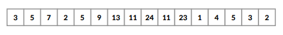  

재귀호출을 이용한 대표적인 정렬

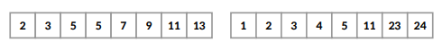  

정렬된 두 리스트로 나눠 맨 앞의 요소를 비교하여 요소를 빼며 정렬

<br>

**합병정렬의 시간복잡도**

합병정렬의 시간복잡도는? `O(NlonN)`

n개를 정렬하는데 드는 시간 = T(n)

T(n) = T(n/2) + T(n/2) + O(N)

logN X O(N) = O(NlogN)

<br>

```python
import sys
import math

def mergeSort(data) :
    '''
    n개의 숫자를 합병정렬을 이용하여 정렬한 결과를 list로 반환하는 함수를 작성하세요.
    '''
    if len(data) == 1: # 기저조건
        return data
        
    mid = len(data)//2
    
    left = mergeSort(data[:mid])
    right = mergeSort(data[mid:])
    
    result = []
    
    leftPtr = 0
    rightPtr = 0
    
    while leftPtr < len(left) or rightPtr < len(right):
        leftValue = left[leftPtr] if leftPtr < len(left) else math.inf
        rightValue = right[rightPtr] if rightPtr < len(right) else math.inf
        if leftValue < rightValue:
            result.append(leftValue)
            leftPtr += 1
        else:
            result.append(rightValue)
            rightPtr += 1
    return result

def main():
    data = [int(x) for x in input().split()]
    print(*mergeSort(data))

if __name__ == "__main__":
    main()
```

<br>

<br>

[실습 4]

## 연속부분최대합 (Medium)

n개의 숫자가 주어질 때, 연속 부분을 선택하여 그 합을 최대화 하는 프로그램을 작성하시오. 예를 들어, 다음과 같이 8개의 숫자가 있다고 하자.

1 2 -4 5 3 -2 9 -10

이 때, 연속 부분이란 연속하여 숫자를 선택하는 것을 말한다. 가능한 연속 부분으로써 [1, 2, -4], [5, 3, -2, 9], [9, -10] 등이 있을 수 있다. 이 연속 부분들 중에서 가장 합이 큰 연속 부분은 [5, 3, -2, 9] 이며, 이보다 더 합을 크게 할 수는 없다. 따라서 연속 부분 최대합은 5+3+(-2)+9 = 15 이다.

### 입력 예시

```
1 2 -4 5 3 -2 9 -10
```

### 출력 예시

```
15
```

<br>

#### 문제 조건

-   입력되는 수의 개수는 최대 100,000개입니다.

<br>

### 풀이

n이 최대 100,000 이므로 완전탐색 `O(N³)` 이용할 수 없다.

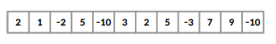  

우선 **절반**으로 나누어 각각을 구해보자

-   왼쪽만 포함하는 경우, 오른쪽만 포함하는 경우, 자른 자리를 포함하는 경우를 살펴보면 된다.

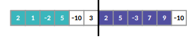  

<br>

자른 자리를 포함하는 경우를 확인하는 Idea

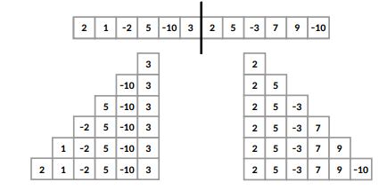  

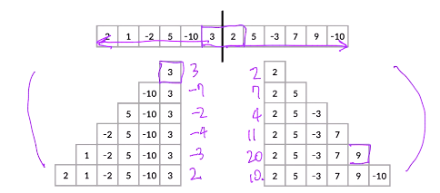  

<br>

**모든 경우를 고려했음**

1.  왼쪽만 포함하는 경우
2.  오른쪽만 포함하는 경우
3.  자른 자리를 포함하는 경우

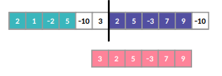 

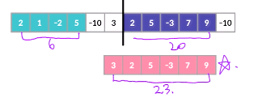   

<br>

**시간복잡도**

`T(N) = 2*T(N/2) + O(N)`

`O(NlogN)`

<br>

```python
import sys

def getSubsum(data) :
    '''
    n개의 숫자가 list로 주어질 때, 그 연속 부분 최대합을 반환하는 함수를 작성하세요.
    '''
    
    n = len(data)
    
    if n == 1 : # 기저조건
        return data[0]
        
    ### 왼쪽, 오른쪽, 양쪽
    
    mid = n//2
    
    left = getSubsum(data[:mid])
    right = getSubsum(data[mid:])
    
    Sum = 0
    
    leftSum = 0
    rightSum = 0
    
    for i in range(mid-1, -1, -1):
        Sum += data[i]
        leftSum = max(Sum, leftSum)
        
    Sum = 0 # 왼쪽했으니 초기화
    
    for i in range(mid, n):
        Sum += data[i]
        rightSum = max(Sum, rightSum)
        
    return max([left, right, leftSum+rightSum])

def main():
    '''
    이 부분은 수정하지 마세요.
    '''

    data = [int(x) for x in input().split()]

    print(getSubsum(data))

if __name__ == "__main__":
    main()
```

<br>