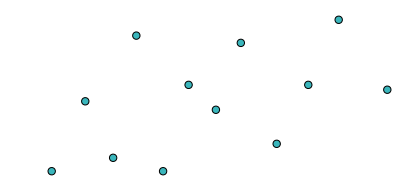
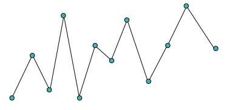
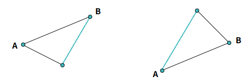

# 탐욕적기법

### 탐욕적기법

**순간의 최적의 선택**이 궁극적으로 최적의 선택이다

**단순한 방법**도 문제 풀이에는 충분하다

<br>

[실습 1]

## 거스름돈

엘리스씨는 1원, 5원, 10원, 50원, 100원 짜리 동전이 **무한개**(!) 존재하는 가게에 근무한다. 손님이 계산을 하고 난 후, 거스름돈을 돌려주어야 하는데 **가능한 적은 수**의 동전을 돌려주고 싶다.

예를 들어, 7원을 돌려줘야 한다면 1원을 7개 돌려줄 수도 있지만, 그것보다는 5원 1개와 1원 2개를 돌려주는 것이 적은 수의 동전을 돌려주는 것이므로, 이것이 더 좋은 경우이다.

거스름돈 n원을 돌려주어야 할 때, 돌려주어야 하는 동전 개수의 최솟값을 출력하는 프로그램을 작성하세요.

### 입력 예시 1

```
7
```

### 출력 예시 1

```
3
```

### 입력 예시 2

```
103
```

### 출력 예시 2

```
4
```

<br>

#### 문제 조건

-   돌려주어야 하는 거스름돈은 최대 100,000,000입니다.

<br>

### 풀이

1원 5원 10원 50원 100원

**173원**

**100원부터 시작해서 최대한 많이 나눠준다.**

<br>

```python
import sys

def coinChange(n) :
    '''
    n원을 돌려주기 위해 필요한 동전 개수의 최솟값을 반환하는 함수를 작성하세요.
    '''
    
    result = 0 # 동전의 개수
    
    coins = [100, 50, 10, 5, 1]
    
    for coin in coins:
        result += n // coin
        n = n%coin # 지불하고 남은 액수

    return result

def main():
    n = int(input())

    print(coinChange(n))

if __name__ == "__main__":
    main()
```

<br>

<br>

[실습 2]

## 기울기가 가장 큰 두 점 찾기 (Big)

2차원 평면에 n개의 점이 있다. 이 점들 중에서 두 점을 선택했을 때, 그 기울기의 절댓값의 최댓값을 출력하는 프로그램을 작성하시오. 단, 모든 점의 x좌표는 다르다고 가정한다. 또한, 두 점 (x1, y1), (x2, y2)의 기울기는 (y2 - y1) / (x2 - x1) 으로 정의된다.

예를 들어, 4개의 점이 각각 (0, 3), (1, 1), (2, 2), (4, 1) 에 위치해 있다고 하면, 기울기의 절댓값의 최댓값은 2가 된다.

이 경우 기울기 절댓값의 최댓값인 2를 출력합니다.

입력으로는 첫줄에 점의 개수가, 그 다음줄부터는 점의 x좌표와 y좌표가 입력됩니다.

#### 입력 예시

```
4
0 3
1 1
2 2
4 1
```

#### 출력 예시

```
2.000
```

<br>

#### 문제 조건

-   점의 개수는 최대 100,000개를 넘지 않습니다.
-   점의 좌표는 모두 정수입니다.
-   출력은 소숫점 넷째자리에서 반올림하여 출력합니다.

<br>

### 풀이

cf) 완전탐색 : `O(N²)` 최대 100억 연산

nC2 = n(n-1)/2

  


**가설**

  

**x축으로 인접한 두 점만 고려해도 충분하다**


**증명** (귀류법)

  

위와 같이 두 점 **A, B사이에 점 C**가 존재하면, A, B의 기울기는 최댓값이 될 수 없다

<br>

점을 x축으로 정렬하고 인접한 두 점만 고려한다.

정렬 : `O(NlogN)` 비교 : `O(N)`

최종 시간복잡도 : `O(NlogN)`

<br>

```python
import sys

def getSlope(a, b):
    return abs((b[1]-a[1])/(b[0]-a[0]))

def maxSlope(points) :
    '''
    n개의 점들 중에서 2개의 점을 선택했을 때, 얻을 수 있는 기울기의 절댓값 중에서 가장 큰 값을 반환하는 함수를 작성하세요.
    '''
    points.sort()
    
    result = 0
    
    for i in range(len(points)-1):
        result = max(result, getSlope(points[i], points[i+1]))

    return result

def main():
    n = int(input())
    points = []

    for i in range(n) :
        line = [int(x) for x in input().split()]
        points.append( (line[0], line[1]) )
    
    # 소숫점 넷째자리에서 반올림
    print("%.3lf" % maxSlope(points))

if __name__ == "__main__":
    main()
```

<br>

<br>

[실습 3]

## Fractional knapsack

n개의 물건이 있고, 각 물건은 무게 w_i와 가치 c_i를 갖는다. 이제 이 물건들을 배낭에 넣으려 한다. 이 배낭은 무게 m까지를 버틸 수 있다.

한 가지 재미있는 사실은, 물건을 쪼갤 수 있다는 것이다. 물론, 물건을 쪼개게 되면 무게가 줄지만, 가치도 줄게 된다. 예를 들어, 무게를 절반으로 줄이면 가치 역시도 절반으로 줄어들게 된다.

배낭이 버틸 수 있는 무게 m과 n개의 물건의 정보가 주어질 때, 배낭이 담을 수 있는 가치의 최댓값을 소숫점 넷째자리에서 반올림하여 출력하는 프로그램을 작성하세요.

입력에 첫줄에는 물건의 개수n과 베낭의 버틸수 있는 무게 m이 입력됩니다.

이후 n개의 줄에 대하여 각 물건의 무게 w_i, 그리고 가치 c_i가 주어진다.

### 입력 예시 1

```
4 10
3 10
2 7
4 9
5 13
```

### 출력 예시 1

```
30.000
```

### 입력 예시 2

```
4 11
3 10
2 7
4 9
5 13
```

### 출력 예시 2

```
32.250
```

<br>

### 문제 조건

-   물건의 개수는 최대 100,000개 입니다.

<br>

### 풀이

cf) 완전탐색 2ⁿ (가능한 모든 조합)

탐욕적 기법 : 가성비 좋은 물건부터 담자

<br>

```python
import sys

def fKnapsack(materials, m) :
    '''
    물건을 가성비 순서대로 넣기
    x[0] : 무게
    x[1] : 가치
    '''
    
    # 배열의 x[1]/x[0] 값을 비교하여 내림차순 정렬
    materials = sorted(materials, key = lambda x: x[1]/x[0], reverse=True)
    
    weight = 0
    value = 0
    
    for i in range(len(materials)):
        # 1. 물건을 넣어도 아직 무게보다 적을 때
        # 2. 물건을 넣으면 딱 m 만큼 무게가 될 때
        # 3. 물건을 다 넣으면 m을 넘어갈 때
        
        if weight + materials[i][0] < m:
            weight += materials[i][0]
            value += materials[i][1]
        elif weight + materials[i][0] == m:
            weight += materials[i][0]
            value += materials[i][1]
            
            return value
        else:
            temp = m - weight # 남은 공간
            value += temp * (materials[i][1]/materials[i][0])
            return value

    return value

def main():
    line = [int(x) for x in input().split()]

    n = line[0]
    m = line[1]

    materials = []

    for i in range(n) :
        data = [int(x) for x in input().split()]
        materials.append( (data[0], data[1]) )

    # 소숫점 넷째자리에서 반올림
    print("%.3lf" % fKnapsack(materials, m))

if __name__ == "__main__":
    main()
```

<br>